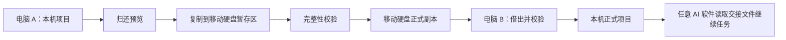

# 带着项目走，换台电脑继续做

**Project Handoff Manager（项目管家）** 是一个面向 Windows 本地 AI 开发项目的开源 Skill。它把完整项目文件夹、当前进度、环境说明和继续任务提示一起交给移动硬盘，让你换电脑或换 AI 软件后，不必重新解释项目，也不必猜上次做到哪里。

[](https://github.com/czd176224-rgb/project-handoff-manager-skill/releases/latest)
[](https://github.com/czd176224-rgb/project-handoff-manager-skill/actions/workflows/test.yml)
[](https://github.com/PowerShell/PowerShell)
[](LICENSE)

[5 分钟开始使用](#5-分钟开始使用) · [它解决什么问题](#它解决什么问题) · [安全机制](#为什么可以放心迁移) · [最新版本](https://github.com/czd176224-rgb/project-handoff-manager-skill/releases/latest)

> 它不是云同步工具，也不会搬运 AI 软件的对话数据库。它只管理你明确指定的项目文件夹，并让项目本身携带可继续工作的交接信息。

## 它解决什么问题

直接复制一个项目文件夹，看起来简单，真正继续工作时却经常遇到这些问题：

- 不知道电脑和移动硬盘上的哪一份才是正式版本。
- 项目复制完了，但另一台电脑缺少环境说明、缓存状态或恢复命令。
- 换了 AI 软件，对方不知道项目目标、限制、当前任务和下一步。
- 想释放本机空间，又担心副本没有复制完整就误删源文件。
- 迁移中断后，不知道应该重新复制、保留双份还是继续收尾。

项目管家把这些问题收敛成一条可检查、可恢复的迁移流程：



复制成功并不等于立即删除。源副本会继续保留，只有用户之后明确发布独立清理指令，项目管家才会再次核对设备、路径、回执和项目身份。

## 四项日常操作

| 操作 | 实际做什么 | 解决的问题 |
| --- | --- | --- |
| 开始或继续项目 | 自动补齐管理结构，读取交接报告并检查环境 | 换电脑或换 AI 后快速恢复上下文 |
| 暂停项目 | 预览并只停止能够证明属于该项目的进程，记录当前任务和下一步 | 释放 CPU、内存，同时保留清晰进度 |
| 归还到移动硬盘 | 暂存复制、完整性校验、提交正式副本；本机来源暂不删除 | 安全带走完整项目，避免复制不完整 |
| 从移动硬盘借出 | 复制到本机暂存区、复核来源、校验并提升为正式目录 | 在另一台电脑继续本地项目 |

迁移失败时还有辅助的 `repair` 恢复入口。它只完成尚未完成的状态更新或清理步骤，不会盲目重新复制、重复删除。

## 适合哪些场景

### 在两台 Windows 电脑之间继续同一项目

在电脑 A 归还到移动硬盘，带到电脑 B 后借出到本机。项目身份、进度和环境说明与文件夹一起移动。

### 从 Codex 切换到 DeepSeek 或其他 AI 软件

项目会生成一份软件中立的 `项目交接/继续项目提示词.md`。只要新的 AI 软件能够访问本地项目文件夹，就可以先读取交接报告、环境清单和继续提示词，再接着完成任务。

### 暂停大项目并释放电脑资源

项目管家会先展示准备停止的进程和判定依据。只有能证明属于当前项目的进程才进入候选；AI 主程序、系统进程和归属不明的进程默认跳过。

### 离线携带项目、依赖和缓存

整个项目目录可以随移动硬盘保留，包括项目内的缓存、离线依赖、`.venv` 或 `node_modules`。这些内容会被记录，但跨电脑后仍应根据锁文件和环境清单验证或重建。

## 5 分钟开始使用

### 1. 准备环境

- Windows 10 或 Windows 11
- Windows PowerShell 5.1，或 PowerShell 7+
- 一块 NTFS 移动硬盘
- Codex 等能够调用本地 Skill/脚本的 AI 工具

仓库示例使用 Samsung T9 和 `T:` 盘符，但盘符、卷标、设备型号和仓库路径都由配置文件指定，并非只能使用该型号或该盘符。

### 2. 安装 Skill

```powershell
git clone https://github.com/czd176224-rgb/project-handoff-manager-skill.git
cd project-handoff-manager-skill
pwsh -File .\scripts\install.ps1
pwsh -File .\scripts\verify_install.ps1
```

没有 Git 也可以从 [最新 Release](https://github.com/czd176224-rgb/project-handoff-manager-skill/releases/latest) 下载源码压缩包，解压后在该目录执行后两条命令。

默认安装到 `$env:CODEX_HOME\skills`；没有设置 `CODEX_HOME` 时安装到当前用户的 `.codex\skills`。安装完成后重新启动 AI 工具或开始一个新任务，让 Skill 清单重新加载。

### 3. 建立自己的配置

复制 [`config.example.json`](config.example.json) 到仓库之外，例如：

```powershell
Copy-Item .\config.example.json 'D:\AI项目管理\项目管家配置.json'
```

然后修改三类路径：

- 本机当前项目、接收暂存和暂停项目目录。
- 移动硬盘中的项目仓库和设备标记位置。
- 当前电脑保存设备信任记录的位置。

真实配置、卷序列、设备标识和信任文件不要提交到公开仓库。

### 4. 用自然语言开始

在项目文件夹中对 AI 说：

```text
使用 $project-handoff-manager，显示项目菜单，并用简洁中文告诉我下一步。
```

第一次归还项目时可以说：

```text
使用项目管家，把当前项目归还到移动硬盘。先只显示预览，不复制、不删除文件。
```

在另一台电脑借出时可以说：

```text
使用项目管家，从移动硬盘借出这个项目到本机。先检查路径、空间和设备身份。
```

AI 会解析脚本的 JSON 结果，再向用户显示简洁中文，而不是直接铺开机器接口。

<details>
<summary><strong>首次登记移动硬盘的技术说明</strong></summary>

正式归还或清理前，当前电脑需要保存移动硬盘的卷序列和随机设备标识。登记分为预览和确认两个阶段：

```powershell
$skillPath = if ($env:CODEX_HOME) {
    Join-Path $env:CODEX_HOME 'skills\project-handoff-manager'
} else {
    Join-Path $env:USERPROFILE '.codex\skills\project-handoff-manager'
}

Import-Module (Join-Path $skillPath 'scripts\ProjectManager.Core.psm1') -Force
$drive = Get-PHMPortableDriveInfo `
    -DriveLetter 'T:' `
    -DeviceMarkerPath 'T:\AI开发工作盘\管理资料\项目管家设备.json'

Register-PHMPortableDevice `
    -DriveInfo $drive `
    -DeviceMarkerPath 'T:\AI开发工作盘\管理资料\项目管家设备.json' `
    -LocalTrustPath 'D:\AI项目管理\项目管家设备信任.json'

Register-PHMPortableDevice `
    -DriveInfo $drive `
    -DeviceMarkerPath 'T:\AI开发工作盘\管理资料\项目管家设备.json' `
    -LocalTrustPath 'D:\AI项目管理\项目管家设备信任.json' `
    -ConfirmRegistration
```

请按自己的盘符和路径修改示例。设备标记保存在移动硬盘，信任记录只保存在当前电脑；另一台电脑需要单独建立本机信任。

</details>

## 一次完整迁移会发生什么

### 从电脑 A 归还到移动硬盘

1. 扫描项目元数据、运行进程、敏感文件和路径风险。
2. 用户确认后，将项目复制到移动硬盘的空暂存目录。
3. 复核来源并校验目标文件清单、大小和哈希。
4. 校验通过后把暂存目录提升为正式项目目录。
5. 本机来源继续保留；只有独立清理确认后才删除。

### 在电脑 B 从移动硬盘借出

1. 检查设备身份、仓库边界、可用空间和目标冲突。
2. 把项目复制到本机接收暂存区并完成校验。
3. 提升为本机正式项目，生成环境检查和继续提示词。
4. 移动硬盘来源继续保留，可以先在本机工作。
5. 需要释放移动硬盘空间时，再另行发布删除旧来源的指令。

## 为什么可以放心迁移

- **先预览**：普通预览只读取配置范围和项目元数据，不进行复制或删除。
- **先暂存**：复制先进入空暂存目录，不直接覆盖正式项目。
- **再校验**：来源复核和目标完整性校验通过后，才提交正式副本。
- **删除独立确认**：传输成功不会自动删除来源，清理是之后的独立操作。
- **路径边界保护**：只允许处理配置仓库中的单个项目目录，并阻断重解析点和错误卷。
- **失败可恢复**：提升、登记或清理中断时保留恢复记录，`repair` 只补齐剩余步骤。
- **不碰 AI 对话数据**：不会读取、修改或复制 Codex/其他 AI 软件的对话数据库。
- **凭据不属于支持范围**：令牌、Cookie、密码和系统级软件不属于迁移目标；预览发现敏感文件时会提示，正式迁移前应先移出项目。

任何文件工具都不能替代备份。重要项目仍建议保留独立备份，并在首次使用时先用测试项目完成一次全流程。

## 项目会携带哪些交接信息

项目管家在项目内维护 `项目交接` 目录，常见文件包括：

| 文件 | 用途 |
| --- | --- |
| `项目身份.json` | 项目编号、正式位置、当前状态和修订信息 |
| `项目交接报告.md` | 项目目标、当前任务、下一步、变更和验证结果 |
| `环境清单.json` | Node、Python、锁文件、缓存和离线依赖状态 |
| `继续项目提示词.md` | 可交给不同 AI 软件的继续任务说明 |
| `转移凭证.json` | 迁移方向、来源、目标和校验依据 |
| `*恢复.json` | 中断后只完成剩余步骤的恢复记录 |

## 命令行参考

日常使用可以交给 AI 调用；需要调试或自动化时，也可以直接运行入口脚本。

```powershell
$entry = '.\project-handoff-manager\scripts\project_manager.ps1'
$config = 'D:\AI项目管理\项目管家配置.json'

# 菜单
pwsh -File $entry -Action menu

# 项目总览
pwsh -File $entry -Action inspect -ConfigPath $config

# 开始或继续项目
pwsh -File $entry -Action resume -ProjectPath 'D:\项目\示例项目'

# 归还预览，不复制
pwsh -File $entry -Action checkin -ProjectPath 'D:\项目\示例项目' -ConfigPath $config

# 借出预览，不复制
pwsh -File $entry -Action checkout -ProjectPath 'T:\项目仓库\暂停项目\示例项目' -ConfigPath $config
```

执行复制、停止进程或清理时，需要在预览后显式加入对应的确认参数。完整参数以脚本输出的精确路径和下一步为准。

## 当前边界

- 当前正式支持 Windows 10/11 和 NTFS 移动硬盘。
- 项目文件夹是事实来源；Skill 不迁移 AI 软件自身的会话和设置。
- 项目内缓存和虚拟环境可以随项目保留，但不保证跨电脑后无需验证即可运行。
- 环境检查目前重点识别 Node.js、Python、锁文件、项目缓存和离线依赖。
- 项目管家不是云备份、版本控制或多人实时协作工具。

## 常见问题

### 必须使用 Samsung T9 或固定盘符吗？

不是。T9 和 `T:` 只是默认示例。盘符、卷标、设备型号、仓库路径和设备标记路径都可以在配置文件中修改。当前要求移动硬盘使用 NTFS。

### 可以在 DeepSeek、Claude 或其他 AI 软件中继续吗？

可以继续项目内容。项目管家生成的交接报告、环境清单和继续提示词都是项目内的普通 Markdown/JSON 文件，不绑定某个 AI 产品。不同软件能否直接安装 Skill，取决于它们各自的扩展机制；即使不能安装，也可以读取这些交接文件继续任务。

### 它会上传项目到云端吗？

不会。核心迁移发生在本机文件夹和移动硬盘之间。

### 传输完成后会自动删除原项目吗？

不会。传输和清理是两个独立操作。源副本在校验成功后仍然保留，只有用户再次明确要求清理时才进入删除流程。

### 项目很大，会不会每次打开菜单都计算全部哈希？

不会。预览使用元数据扫描；正式传输校验才计算完整性信息，后续可复用元数据未变化文件的既有哈希。

### 支持 macOS 或 Linux 吗？

当前不支持。现版本使用 Windows PowerShell、Windows 进程信息和 NTFS 移动硬盘边界。

## 工程验证

`v1.1.1` 发布前完成了 133 项 Pester 测试，覆盖：

- 安装、重复安装、可恢复升级和独立目录验证。
- 项目纳管、交接报告、环境检查和 AI 中立继续提示词。
- 归还、借出、独立清理和三类中断恢复路径。
- 错误磁盘、路径越界、重解析点、目标冲突和不可读文件。
- Windows PowerShell 5.1、PowerShell 7+ 和公开文件隐私扫描。

GitHub Actions 在每次 PR 和 `main` 推送时运行 Windows 测试、Skill 验证、隔离安装及隐私检查。测试源码位于 [`tests`](tests)，工作流位于 [`.github/workflows/test.yml`](.github/workflows/test.yml)。

## 参与项目

- 遇到问题：提交 [Issue](https://github.com/czd176224-rgb/project-handoff-manager-skill/issues)，请使用虚拟路径并删除设备序列号、信任记录和凭据。
- 发现安全问题：请阅读 [`SECURITY.md`](SECURITY.md)，通过 GitHub Security Advisory 私下报告。
- 准备贡献代码：请先阅读 [`CONTRIBUTING.md`](CONTRIBUTING.md)。

如果这个 Skill 帮你顺利完成了一次跨电脑或跨 AI 软件迁移，欢迎给仓库一个 Star，并分享你的使用场景。真实反馈会优先决定下一步改进，而不是继续堆叠附加功能。

## 许可证

[MIT License](LICENSE)
